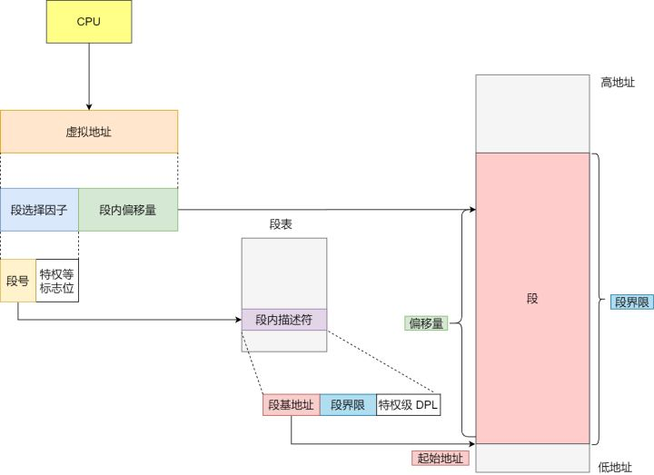
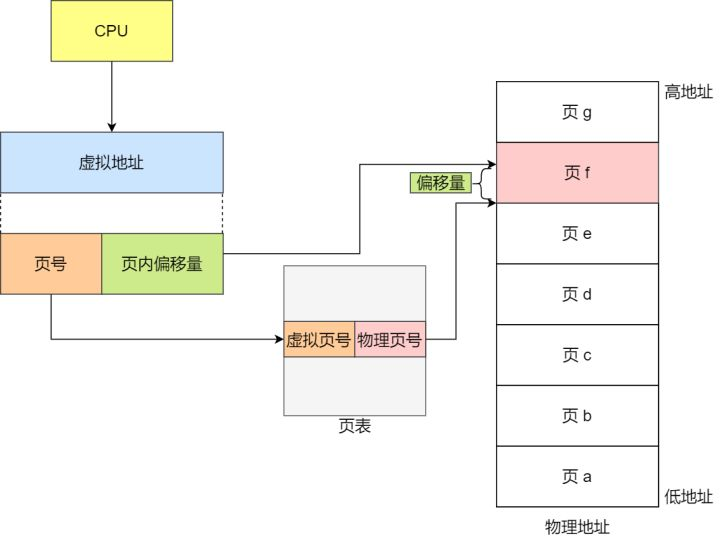
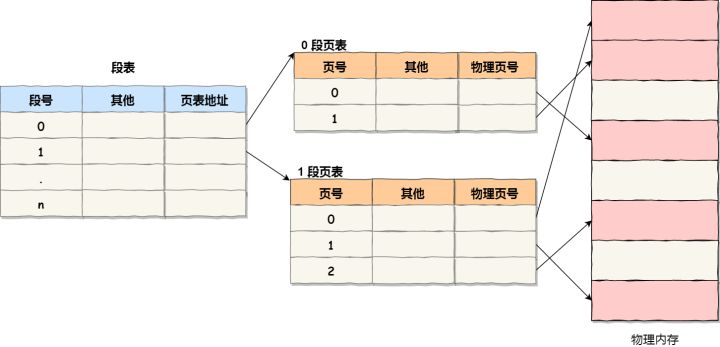

# ⭕ 内存调度
直接访问物理内存，则进程的「地址空间不隔离」，容易发生越界访问产生bug使得程序崩溃。
所以引入中间层，利用一种间接的地址访问方法访问物理内存，即「虚拟内存」。
操作系统引入了虚拟内存，进程持有的虚拟地址会通过 CPU 芯片中的内存管理单元（MMU）的映射关系，来转换变成物理地址，然后再通过物理地址访问内存。

实现时主要有两种方式分别是「内存分段」和「内存分页」。

## 内存分段
程序是由若干个逻辑分段组成的，如可由代码分段、数据分段、栈段、堆段组成。
不同的段是有不同的属性的，所以就用分段（Segmentation）的形式把这些段分离出来。
分段机制下的虚拟地址由两部分组成，「段选择子」和「段内偏移量」。

<!--  -->

<div align="center">    
    
</div>

分段可能产生「内存碎片」问题，即存在多块小块不连续的物理内存空间。
由于存在内存碎片，可能就会导致「内存交换的效率低」的问题。

## 内存分页

> Linux 中使用分页管理内存。

让需要交换写入或者从磁盘装载的数据更少一点，这样就可以解决问题了。也就是内存分页（Paging）。
分页是把**整个虚拟和物理内存空间切成一段段固定尺寸的大小**。这样一个连续并且尺寸固定的内存空间，我们叫页（Page）。
分页机制下的虚拟地址由两部分组成，「页号」和「页内偏移量」。

<!--  -->

<div align="center">    
    
</div>


### 多级页表

> 解决页表存储空间大的问题。

单级页表可能会消耗巨大的物理空间。
考虑到「局部性原理」，提出二级页表的设计。
如果某个一级页表的页表项没有被用到，也就不需要创建这个页表项对应的二级页表了，即可以在需要时才创建二级页表。

<!--  -->

<div align="center">    
    
</div>

### 快表/页表缓存

> 解决页表访问效率慢的问题。

在 CPU 芯片中，加入了一个专门存放程序最常访问的页表项的 Cache，即Translation Lookaside Buffer（表/页表缓存）。
有了 TLB 后，那么 CPU 在寻址时，会先查 TLB，如果没找到，才会继续查常规的页表。

### 换入换出与缺页异常

在地址映射过程中，若在页面中发现所要访问的页面不在内存中，则产生「缺页中断」。当发生「缺页中断」时，如果操作系统内存中没有空闲页面，则操作系统必须在内存选择一个页面将其移出内存，以便为即将调入的页面让出空间。而用来选择淘汰哪一页的规则叫做页面置换算法。

**先进先出(FIFO)算法**：置换最先调入内存的页面，即置换在内存中驻留时间最久的页面。按照进入内存的先后次序排列成队列，从队尾进入，从队首删除。

**最近最少使用（LRU）算法**: 置换最近一段时间以来最长时间未访问过的页面。根据程序局部性原理，刚被访问的页面，可能马上又要被访问；而较长时间内没有被访问的页面，可能最近不会被访问。

## 段页式内存管理

分段和内存分页可以组合起来在同一个系统中使用的，即「段页式内存管理」。
先将程序划分为多个有逻辑意义的段，接着再把每个段划分为多个页。
这样，地址结构就由「段号、段内页号和页内位移」三部分组成。

<!--  -->

<div align="center">    
    
</div>


# ⭕ 线程与进程

## 线程与进程的区别:

* 进程是资源分配的独立单位；线程是资源调度的独立单位。
  
* 进程拥有自己的资源空间，启动一个进程，系统就会为它分配地址空间；而线程与CPU源分配无关，多线程共享同一进程内的资源，使用相同的地址空间。
  
* 一个进程可以包含若干个线程。

|                | 多进程                                                           | 多线程                                                         |
| -------------- | ---------------------------------------------------------------- | -------------------------------------------------------------- |
| 数据共享、同步 | 数据共享复杂，需要用 IPC；数据是分开的，同步简单                 | 因为共享进程数据，数据共享简单，但也是因为这个原因导致同步复杂 |
| 内存、CPU      | 占用内存多，切换复杂，CPU 利用率低                               | 占用内存少，切换简单，CPU 利用率高                             |
| 创建销毁、切换 | 创建销毁、切换复杂，速度慢                                       | 创建销毁、切换简单，速度很快                                   |
| 编程、调试     | 编程简单，调试简单                                               | 编程复杂，调试复杂                                             |
| 可靠性         | 进程间不会互相影响                                               | 一个线程挂掉将导致整个进程挂掉                                 |
| 分布式         | 适应于多核、多机分布式；如果一台机器不够，扩展到多台机器比较简单 | 适应于多核分布式                                               |

## 线程与进程优劣

|      | 多进程                                   | 多线程                                   |
| ---- | ---------------------------------------- | ---------------------------------------- |
| 优点 | 编程、调试简单，可靠性较高               | 创建、销毁、切换速度快，内存、资源占用小 |
| 缺点 | 创建、销毁、切换速度慢，内存、资源占用大 | 编程、调试复杂，可靠性较差               |

## 线程与进程的选择

* 需要频繁创建销毁的优先用线程
* 需要进行大量计算的优先使用线程
* 强相关的处理用线程，弱相关的处理用进程
* 可能要扩展到多机分布的用进程，多核分布的用线程

> 多进程与多线程间的对比、优劣与选择来自：[多线程还是多进程的选择及区别](https://blog.csdn.net/lishenglong666/article/details/8557215)

# ⭕ 主机字节序与网络字节序

## 主机字节序（CPU 字节序）

主机字节序又叫 CPU 字节序，其不是由操作系统决定的，而是由 CPU 指令集架构决定的。主机字节序分为两种：

* 大端字节序（Big Endian）：高序字节存储在低位地址，低序字节存储在高位地址
* 小端字节序（Little Endian）：高序字节存储在高位地址，低序字节存储在低位地址

### 存储方式

32 位整数 `0x12345678` 是从起始位置为 `0x00` 的地址开始存放，则：

内存地址 | 0x00 | 0x01 | 0x02 | 0x03
---|---|---|---|---
大端|12|34|56|78
小端|78|56|34|12

### 判断大端小端


可以这样判断自己 CPU 字节序是大端还是小端：

```cpp
#include <iostream>
using namespace std;

int main()
{
	int i = 0x12345678;

	if (*((char*)&i) == 0x12)
		cout << "大端" << endl;
	else	
		cout << "小端" << endl;

	return 0;
}
```

## 网络字节序

网络字节顺序是 TCP/IP 中规定好的一种数据表示格式，它与具体的 CPU 类型、操作系统等无关，从而可以保证数据在不同主机之间传输时能够被正确解释。

网络字节顺序采用：大端（Big Endian）排列方式。

在Linux中，有一下接口
格式|主机->网络|网络->主机
---|---|---
short（端口）|`htons`|`ntohs`
点分十进制（IP）|` inet_pton()`|`inet_ntop()`


# ⭕ 进程的状态与调度

## 进程的三种状态

进程在运行中不断地改变其运行状态。通常，一个运行进程必须具有以下三种基本状态。

* **就绪（Ready）状态**：当进程已分配到除CPU以外的所有必要的资源，只要获得处理机便可立即执行，这时的进程状态称为就绪状态。

* **执行（Running）状态**：当进程已获得处理机，其程序正在处理机上执行。

* **阻塞（Blocked）状态**：正在执行的进程，由于等待某个事件发生而无法执行时，便放弃处理机而处于阻塞状态。引起进程阻塞的事件可有多种，例如，等待I/O完成、申请缓冲区不能满足、等待信件(信号)等。

## 进程的调度方式

|            | 先来先服务        | 最短作业     | 高响应度比 | 轮转法   | 最短剩余时间 | 多级反馈队列    |
| ---------- | ----------------- | ------------ | ---------- | -------- | ------------ | --------------- |
| 调度方式   | 非抢占            | 非抢占       | 非抢占     | 抢占     | 抢占         | 抢占            |
| 对进程作用 | 不利于I\O繁忙作业 | 不利于长进程 | 较好均衡   | 较好均衡 | 不利于长进程 | 偏爱I\O繁忙作业 |

* **高响应比优先调度算法**：为每个作业引入「动态优先权」，使作业的优先级随着等待时间的增加：*优先权 =（等待时间+要求服务时间)/要求服务时间 = 响应时间 / 要求服务时间*。

* **多级反馈队列算法**:
  1. 先将任务放入第一个队列的末尾，使用时间片轮转法调度。
  2. 如果时间片内完成，便可准备撤离系统，如果时间片内未能完成，便调入下一个队列。
  3. 当之前的队列没有任务时再运行之后的队列，之后的队列比之前的队列时间片长2倍。

# ⭕ 进程通讯(IPC)

> 进程之间的资源是独立的，讲「通讯」。

* **管道**。管道的通知机制类似于缓存，就像一个进程把数据放在某个缓存区域，然后等着另外一个进程去拿（FIFO），并且是管道是单向传输的。
  + 优点：比较简单。
  + 缺点：会阻塞进程，这种通信方式效率低下，且缓存区大小有限。

  
  管道可以分为两大类：

  + 有名管道：适合于无亲缘关系进程间的通信。
  + 匿名管道：适合于有亲缘关系进程间的通信。

* **消息队列**。一系列保存在内核中消息的链表。

用户进程可以向消息队列添加消息，也可以向消息队列读取消息。
消息队列与管道通信相比，其优势是对每个消息指定特定的消息类型，

  + 优点：接收的时候不需要按照队列次序，而是可以根据自定义条件接收特定类型的消息。把进程的数据放在某个内存之后就马上让进程返回，不阻塞。
  + 缺点：如果进程发送的数据占的内存比较大，并且两个进程之间的通信特别频繁的话，需要花很多时间来读内存。

* **共享内存**。共享内存可以解决拷贝所消耗的时间。

	系统加载一个进程的时候，分配给进程的内存并不是实际物理内存，而是虚拟内存空间。那么我们可以让两个进程各自拿出一块虚拟地址空间来，然后映射到相同的物理内存中，这样，两个进程虽然有着独立的虚拟内存空间，但有一部分却是映射到相同的物理内存，这就完成了内存共享机制了。
	**使用信号量规避冲突。**

* **套接字（Socket）**。可用于不同计算机间的进程通信
  + 优点：
    - 传输数据为字节级，传输数据可自定义，数据量小效率高		
    - 可以加密,数据安全性强
  + 缺点：需对传输的数据进行解析。

	
	> 参考计算机网络内容
	
	
* **信号量（semaphore）**：信号量用于实现进程间的互斥与同步，而不是用于存储进程间通信数据。

* **信号（signal）**：用于通知接收进程某个事件已经发生.

其中信号(signal)和信号量(semaphore)本质上并不算是进程间通信方式，应该是进程间同步的方式，但是也可以起到一定的通信作用，故也列在上面。

另外普通的mutex是作用线程间同步用的，但是可以将进程A和进程B共享的内存中初始化一个mutex，这样就可以用将此mutex用作进程间通信用了。

# ⭕ 线程间的同步方式

> 线程之间的资源是共享的，讲安全，讲「同步」。

「同步」指对在一个系统中所发生的事件之间进行协调，在时间上出现一致性与统一化的现象。线程间有如下同步方式：

* 信号(signal)。
* 信号量(semaphore)。
* 锁，锁有一下几种：
  + **互斥量（mutex）**：互斥锁，得到锁的线程才可以进入临界区执行代码。当线程抢互斥锁失败的时候，线程会陷入休眠。优点就是节省CPU资源，缺点就是休眠唤醒会消耗一点时间。依据同一线程是否能多次加锁，把互斥量又分为如下两类：
    - 可重入锁（reentrant mutex）：同一个线程在外层方法获取锁的时候，再进入该线程的内层方法会自动获取锁。可以一定程度避免死锁。
    - 不可重入锁（non-reentrant mutex）。

  + **条件变量（condition variable）**：条件变量不是锁，它解决的问题不是「互斥」，而是「等待」。例如「生产者消费者」模式中，直到队列中有内容了，消费者才加锁。

  + **读写锁**： 是针对读多写少的优化：

    - 当读写锁被加了「写锁」时，其他线程对该锁加读锁或者写锁都会阻塞。 
    - 当读写锁被加了「读锁」时，其他线程对该锁加写锁会阻塞，加读锁会成功。

  + **自旋锁（spinlock）**：不同于互斥变量，当抢锁失败时会「进入休眠」，自旋锁是一个「busy waiting」的过程，其不进入休眠。其减少了不必要的上下文切换，执行速度快，但是浪费CPU。

## 死锁

「死锁」是指两个或两个以上的进程在执行过程中，由于竞争资源或者由于彼此通信而造成的一种阻塞的现象，若无外力作用，它们都将无法推进下去。

### 死锁产生条件

* **互斥**：在一段时间内某资源只由一个线程占用。
* **请求和保持**：指线程已经保持至少一个资源，但又提出了新的资源请求，而该资源已被其它进程占有，此时请求进程阻塞，但又对自己已获得的其它资源保持不放。
* **不剥夺**：指线程已获得的资源，在未使用完之前，不能被剥夺，只能在使用完时由自己释放。
* **环路**：指在发生死锁时，必然存在一个进程——资源的环形链，即进程集合{P0，P1，P2，···，Pn}中的P0正在等待一个P1占用的资源；P1正在等待P2占用的资源，……，Pn正在等待已被P0占用的资源。

### 预防死锁

* **破坏互斥条件**：使资源同时访问而非互斥使用，就没有进程会阻塞在资源上，从而不发生死锁。只读数据文件可采用这种办法管理。
* **破坏请求和保持条件**：当一进程占有一独占性资源后又申请一独占性资源而无法满足，则退出原占有的资源。
* **破坏不剥夺条件**：通过设置一个”最长占用时间“来强迫线程归还钥匙。
* **破坏环路等待条件**： 强制规定任何线程取钥匙都需要按指定顺序。

### 避免死锁

安全序列是指系统能按某种进程推进顺序（P1, P2, P3, …, Pn），为每个进程分配其所需要的资源，直至每个进程都可以顺序地完成。「银行家算法」就是一种寻找安全序列的算法。

- **银行家算法**：当进程首次申请资源时，要测试该进程对资源的「最大需求量」，如果系统现存的资源可以满足它的最大需求量则按当前的申请量分配资源，否则就推迟分配。当进程在执行中继续申请资源时，先测试该进程已占用的资源数与本次申请资源数之和是否超过了该进程对资源的最大需求量。若超过则拒绝分配资源。若没超过则再测试系统现存的资源能否满足该进程尚需的最大资源量，若满足则按当前的申请量分配资源，否则也要推迟分配。


### 解除死锁

- **资源剥夺**：挂起某些死锁进程，并抢占它的资源，将这些资源分配给其他死锁进程。
- **撤销进程**：强制撤销部分、甚至全部死锁进程并剥夺这些进程的资源。
- **进程回退**：让一个或多个进程回退到足以避免死锁的地步。进程回退时自愿释放资源而不是被剥夺。要求系统保持进程的历史信息，设置还原点。
