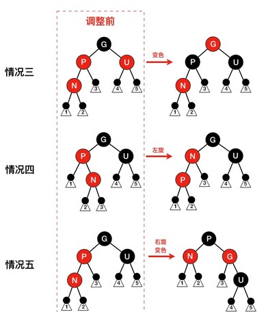
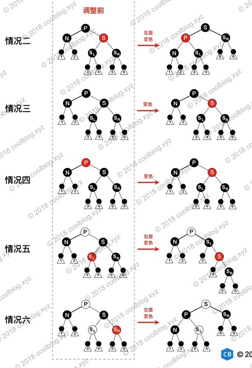
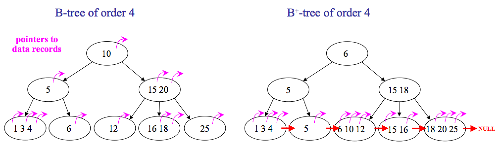

# 红黑树


广泛用在C++的STL中。如map和set都是用红黑树实现的. 
ref: https://segmentfault.com/a/1190000012728513


##  性质
- 节点是红色或黑色。
- 根是黑色。
- 所有叶子都是黑色（叶子是NIL节点）。
- 每个红色节点必须有两个黑色的子节点。（从每个叶子到根的所有路径上不能有- 两个连续的红色节点。）
- 从任一节点到其每个叶子的所有简单路径都包含相同数目的黑色节点（简称黑高）。

## 插入
- 父节点是黑色，直接插，不影响黑高相等性质
- 父节点是红色，观察叔节点：
    - 若叔节点是红色，则变色，（父、叔——>黑， 祖父——>红），然后继续以祖父节点为新节点递归。
    - 若叔节点是黑色，则需要先对父节点与插入节点做处理，随后再对祖父节点做旋转与变色。

    
    

## 删除
将删除目标使用其前继或者后续节点替换，再对替换节点进行删除。
此时，替换节点只有一个子节点，负责便不满住前继或后继节点的要求。

- 若替换节点为红色，则直接用其子节点补位。
- 若替换节点为黑色，考虑子节点颜色。
    - 若其子节点为红色，则删除替换节点后将子节点变色补位即可。
    - 若其子节点为黑色，则需要考虑不同的情况，最终将其变化为一种可以保持黑高一致性的情况。

    
    

## 有平衡树（AVL）为啥还需要红黑树？
与平衡树不同的是，红黑树在插入、删除等操作，不会像平衡树那样，频繁着破坏红黑树的规则，所以不需要频繁着调整，这也是我们为什么大多数情况下使用红黑树的原因。 单单在查找方面的效率的话，平衡树比红黑树快。
所以，红黑树是一种不大严格的平衡树。也可以说是一个折中发方案。

# ⭕ 跳表
> redis 底层使用的数据结构
## 结构
链表加多级索引的结构，就叫做跳表。

    
    

## 与红黑树的比较
- skiplist的复杂度和红黑树一样，而且实现起来更简单。
- 在并发环境下skiplist有另外一个优势，红黑树在插入和删除的时候可能需要做一些rebalance的操作，这样的操作可能会涉及到整个树的其他部分，而skiplist的操作显然更加局部性一些，锁需要盯住的节点更少，因此在这样的情况下性能好一些。
- 跳表需要额外的空间，红黑树不需要。
- 跳表是排序好的。

# ⭕ B树与B+树
> 用在磁盘文件组织，数据索引和数据库索引。
> ref: https://zhuanlan.zhihu.com/p/130482609
## 基本概念
B树是一颗多路平衡查找树。

- 每个节点最多有m-1个关键字（可以存有的键值对）。
- 根节点最少可以只有1个关键字，非根节点至少有m/2个关键字。
- 每个节点中的关键字都按照从小到大的顺序排列，每个关键字的左子树中的所有- 关键字都小于它，而右子树中的所有关键字都大于它。
- 所有叶子节点都位于同一层，或者说根节点到每个叶子节点的长度都相同。
- 每个节点都存有索引和数据，也就是对应的key和value。

B+树是B树的改版。

- B+树有两种类型的节点：内部结点（也称索引结点）和叶子结点。
- 内部节点就是非叶子节点，内部节点不存储数据，**只存储索引**，数据都存储在叶子节点。
- 内部结点中的key都按照从小到大的顺序排列，对于内部结点中的一个key，左树中的所有key都小于它，右子树中的key都大于等于它。
- 叶子结点中的记录也按照key的大小排列。每个叶子结点都存有相邻叶子结点的指针，叶子结点本身依关键字的大小自小而大顺序链接。父节点存有右孩子的第一个元素的索引。

    
    

## B+树的优势
- 单一节点存储的元素更多，使得查询的IO次数更少，所以也就使得它更适合做为数据库MySQL的底层数据结构了。
- 所有的查询都要查找到叶子节点，查询性能是稳定的，而B树，每个节点都可以查找到数据，所以不稳定。
- 所有的叶子节点形成了一个有序链表，更加便于查找。

## 相关问题
### 为什么文件/数据库索引要用B树而不用二叉查找树？
磁盘里的数据加载到内存中的时候，是以页为单位来加载的。
而节点与节点之间的数据是不连续的，所以不同的节点，很有可能分布在不同的磁盘页中。虽然二叉树的对比次数可能更少，但是需要更多的IO时间，所以不使用二叉树。

因为B树不管叶子节点还是非叶子节点，都会保存数据，这样导致在非叶子节点中能保存的指针数量变少（有些资料也称为扇出）

指针少的情况下要保存大量数据，只能增加树的高度，导致IO操作变多，查询性能变低；

### 为什么 MongoDB 索引选择B树，而 Mysql 选择B+树？
在关系型数据中，遍历操作比较常见。B+树由于数据全部存储在叶子节点，并且通过指针串在一起，这样就很容易的进行区间遍历甚至全部遍历，因此采用B+树作为索引，比较合适。

而在非关系型数据库中，单一查询比较常见。B树所有节点都有Data域，只要找到指定索引就可以进行访问，无疑单次查询平均快于B+树。

