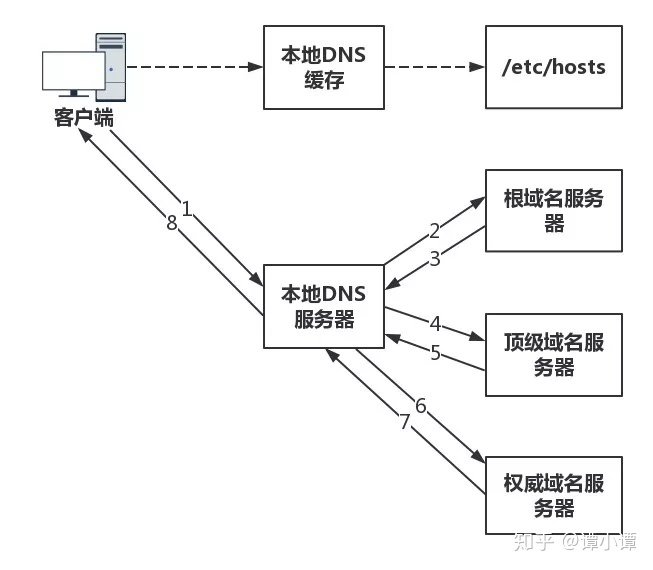

# DNS

## 为什么域名解析用UDP协议?

因为UDP快，UDP的DNS协议只要一个请求、一个应答就好了。而使用基于TCP的DNS协议要三次握手、发送数据以及应答、四次挥手。但是UDP协议传输内容不能超过512字节。不过客户端向DNS服务器查询域名，一般返回的内容都不超过512字节，用UDP传输即可。

但是，现在由于安全性考虑，开始使用TCP + SSL进行传输。

## DNS 如何解析域名？

DNS 的解析流程就是分级查询。

1. 先在本机的DNS里头查（浏览器，操作系统，host文件），如果有就直接返回了。
2. 本机DNS里头发现没有，就去根服务器里查。根域名根据顶级域名，返回其对应的「顶级域名服务器」的IP地址。
3. 如果顶级域名服务器找不到，根据其二级域名，到「权威服务器」里查找。

    
    

