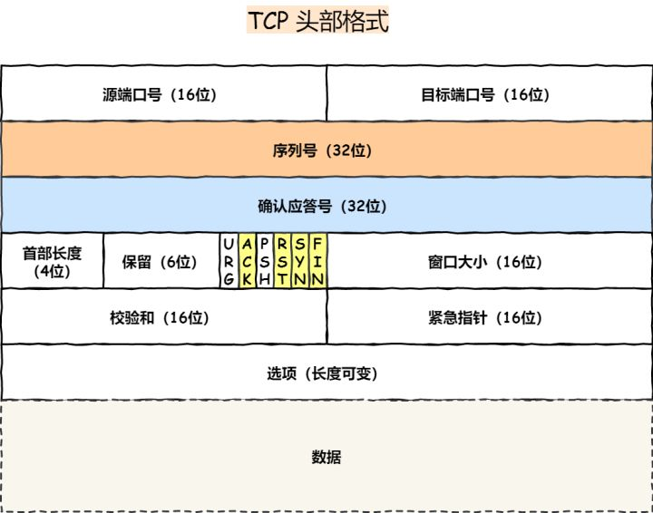
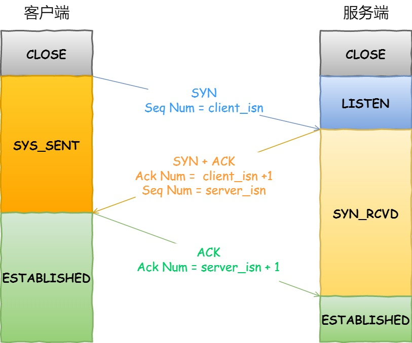

## ⭕ TCP 与 UDP

> 详细内容参考：https://zhuanlan.zhihu.com/p/165497660

**用户数据报协议 UDP（User Datagram Protocol）** 是无连接的，尽最大可能交付，没有拥塞控制，面向报文（对于应用程序传下来的报文不合并也不拆分，只是添加 UDP 首部），支持一对一、一对多、多对一和多对多的交互通信。

**传输控制协议 TCP（Transmission Control Protocol）** 是面向连接的，提供可靠交付，有流量控制，拥塞控制，提供全双工通信，面向字节流（把应用层传下来的报文看成字节流，把字节流组织成大小不等的数据块），每一条 TCP 连接只能是点对点的（一对一）。

### TCP 与 UDP区别：

1. 连接

    TCP 是面向连接的传输层协议，传输数据前先要建立连接。
    UDP 是不需要连接，即刻传输数据。

2. 服务对象

    TCP 是一对一的两点服务，即一条连接只有两个端点。
    UDP 支持一对一、一对多、多对多的交互通信

3. 可靠性

    TCP 是可靠交付数据的，数据可以无差错、不丢失、不重复、按需到达。
    UDP 是尽最大努力交付，不保证可靠交付数据。

    TCP 使用「超时重传」来实现可靠传输：如果一个已经发送的报文段在超时时间内没有收到确认，那么就重传这个报文段。

4. 拥塞控制、流量控制

    TCP 有拥塞控制和流量控制机制，保证数据传输的安全性。
    UDP 则没有，即使网络非常拥堵了，也不会影响 UDP 的发送速率。

5. 首部开销

    TCP 首部长度较长，会有一定的开销，首部在没有使用「选项」字段时是 20 个字节，如果使用了「选项」字段则会变长的。
    UDP 首部只有 8 个字节，并且是固定不变的，开销较小。

 ### TCP 和 UDP 应用场景：
    
 由于 TCP 是「面向连接」，能保证数据的可靠性交付，因此经常用于：

   + FTP 文件传输
   + HTTP / HTTPS

 由于 UDP 「面向无连接」，它可以随时发送数据，再加上UDP本身的处理既简单又高效，因此经常用于：

   + 包总量较少的通信，如 DNS 、SNMP 等
   + 视频、音频等多媒体通信
   + 广播通信

### TCP 与 UDP 头部

#### TCP 头部

**序列号**：在建立连接时由计算机生成的随机数作为其初始值，通过 `SYN` 包传给接收端主机，每发送一次数据，就「累加」一次该「数据字节数」的大小。用来解决网络包乱序问题。

**确认应答号**：指下一次「期望」收到的数据的序列号，发送端收到这个确认应答以后可以认为在这个序号以前的数据都已经被正常接收。用来解决不丢包的问题。

各种「控制位」用于建立连接

#### UDP 头部

UDP 协议简单，头部只有 8 个字节（ 64 位），UDP 的头部格式如下：

### TCP建立连接 -- 三次握手

TCP 是面向连接的协议，所以使用 TCP 前必须先建立连接，而建立连接是通过三次握手而进行的。

#### 为什么是三次握手？不是两次、四次？

- **为了防止失效的连接初始化造成混乱（主要原因）**：如果服务端确认了失效的连接，则客户端会在最后一次发送「RST」终止连接。
- **保证双方具有接收和发送的能力。** 由于有收发能力可以同步双发的初始「序列号」。
- **三次握手就已经理论上最少可靠连接建立**：因为第二次握手时服务器可以同时发送「序列号」和「确认号」。

#### 既然 IP 层会分片，为什么 TCP 层还需要 MSS 呢？

* MTU：一个网络包的最大长度；
* MSS：去除TCP头部之后，一个TCP包所能容纳的数据的最大长度；

IP 层本身没有超时重传机制，它由传输层的 TCP 来负责超时和重传。

如果发生缺失，那么将要重新发送整个以MTU为单位的包，可能很大，所以效率低。使用MSS对数据分割，保证重发的包的数据是以MSS为单位，提高了效率。

### TCP 连接断开 -- 四次挥手

#### 为什么挥手需要四次？

> A 为主动关闭者，B为被动关闭者。

关闭连接时，A向B发送 `FIN` 时，仅仅表示 A 不再发送数据了但是还能接收数据。B 收到客户端的 `FIN` 报文时，先回一个 `ACK` 应答报文，而B可能还有数据需要处理和发送，等B不再发送数据时，才发送 `FIN` 报文给客户端来表示同意现在关闭连接。

从上面过程可知，B通常需要等待完成数据的发送和处理，所以 B 的 `ACK` 和 `FIN` 一般都会分开发送，从而比三次握手导致多了一次。

#### 为什么 TIME_WAIT 等待的时间是 2MSL

`MSL` 是Maximum Segment Lifetime，报文最大生存时间。

**确保最后一个 `ACK` 能够到达**。如果B在最后一个 `FIN` 发送后的 `1MSL` 后没收到发送来的 `ACK` 报文，那么就会重新发送 `FIN`。A 等待一段时间就是为了处理这种情况的发生。

**让两个方向上的数据包都被丢弃**，使得原来连接的数据包在网络中都自然消失，再出现的数据包一定都是新建立连接所产生的
